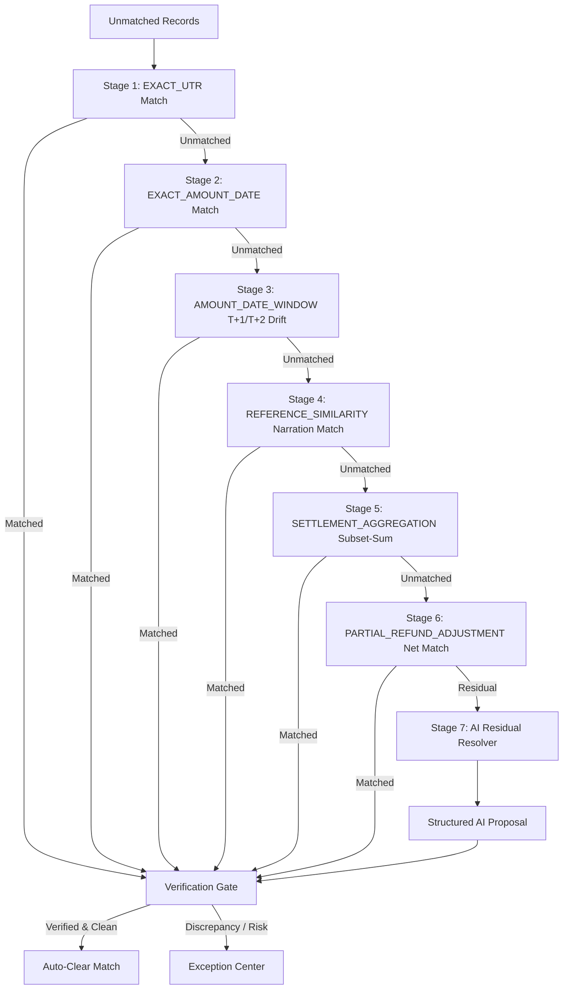

# System Architecture — AI Finance Controller
**Razorpay AI Buildathon — Track 04: AI Finance Controller ("Run the books and the cash position")**

---

## 1. Architectural North Star

```
RAZORPAY GATEWAY MANIFESTS
             +
   BANK STATEMENT (MT940/CSV)
             +
  MERCHANT ERP INVOICE LEDGER
             │
             ▼
     [Data Normalization]
             │
             ▼
[Deterministic Multi-Stage Matching Engine] ── Stage 1: Exact UTR
             │                             ── Stage 2: Exact Amount + Date
             │                             ── Stage 3: Amount Window (T+1/T+2)
             │                             ── Stage 4: Narration Reference
             │                             ── Stage 5: Subset-Sum Bulk Credit
             │                             ── Stage 6: Partial Refund Net
             ▼
  [Residuals / Ambiguous Cases]
             │
             ▼
   [AI Residual Investigator]  ◄── Provider (Gemini / Claude / Deterministic Fallback)
             │
             ▼ (Structured Proposal: reasoning, evidence, confidence, proposed_net)
             │
             ▼
 ┌──────────────────────────────────────┐
 │   FINANCIAL VERIFICATION GATE        │
 │  (Strict Decimal Arithmetic Math)    │
 └──────────────────┬───────────────────┘
                    │
         ┌──────────┴──────────┐
         ▼                     ▼
      [PASS]                 [FAIL]
         │                     │
         ▼                     ▼
 [Auto-Cleared Match]   [Exception Queue]
         │                     │
         │              [Human Approval Gate] (For High-Risk Actions)
         │                     │
         └──────────┬──────────┘
                    │
                    ▼
          [Immutable Audit Trail]
                    │
                    ▼
     [Post-Action Loop Verification]
                    │
                    ▼
 [Fintech Dashboard & Vaani Voice Interface]
```

---

## 2. Core Separation of Concerns

Financial systems demand zero tolerance for monetary hallucination. The architecture enforces an inviolable boundary:

| Responsibility | Layer | Technology | Guarantee |
| :--- | :--- | :--- | :--- |
| **Monetary Calculations** | Deterministic Core | Python `Decimal`, Pydantic v2 | Exact paise accuracy; zero float drift (`ROUND_HALF_UP`) |
| **Matching Decisions** | Deterministic Matching Engine | Multi-stage rule hierarchy | 100% reproducible pairings with explicit strategy tags |
| **Posting Eligibility** | Financial Verification Gate | Strict Debit-Credit checks | **Zero Wrong Auto-Posts**: No proposal posted without verified proof |
| **Ambiguity Investigation** | AI Residual Resolver | LLM / Multi-Agent Orchestrator | Structured hypothesis generation with evidence trails |
| **Operational Control** | Human-in-the-Loop Queue | React 19 Frontend + FastAPI REST | High-risk actions require operator sign-off |
| **Auditing & Compliance** | Immutable Event Ledger | Structured Event Store | Complete event logs with before/after state snapshots |

---

## 3. Multi-Source Ingestion & Normalization

The controller ingests and normalizes data across three distinct financial ledgers:

1. **Source A: Gateway Settlements (`RazorpaySettlementItem`)**
   - Ingests captured merchant orders, fee deductions, contracted MDR rates, and statutory GST schedules.
2. **Source B: Bank Statements (`BankStatementRecord`)**
   - Ingests bank credits, bank transaction references, settlement dates, and raw unstructured bank narrations (`CMS/RAZORPAY/...`).
3. **Source C: Merchant Ledger / Invoices (`MerchantLedgerEntry`)**
   - Ingests internal ERP invoice IDs, customer metadata, gross order values, and receivable dates.

---

## 4. Sequential 7-Stage Matching Pipeline

Matches progress through a strict deterministic hierarchy before escalating to AI:



---

## 5. The Financial Verification Gate

Every candidate match and AI proposal must pass through the `FinancialVerificationGate`.

### Authoritative Formula:
$$\text{Theoretical Net Settlement} = \text{Gross} - \text{MDR} - \text{GST on MDR} - \text{TDS} - \text{Refunds} - \text{Chargebacks} - \text{Other Deductions}$$
$$\text{Variance} = \text{Theoretical Net Settlement} - \text{Actual Bank Credit}$$

### Verification Invariants:
1. **Debit-Credit Balance**: $|\text{Variance}| \le \text{₹}0.05$.
2. **Unique UTR Guard**: Re-use of an existing UTR flags `DUPLICATE_UTR_DETECTED` and immediately rejects.
3. **Statutory Tax Alignment**: GST on MDR must equal exactly $18.00\%$ of MDR amount ($\pm \text{₹}0.02$).
4. **Three-Way Integrity**: Source C merchant invoice must exist and not be an unrecorded ERP draft.
5. **AI Safety Rule**: AI claims of "MATCHED" with $|\text{Variance}| > \text{₹}0.05$ are automatically rejected and logged.

---

## 6. Post-Action Verification & Closed-Loop Resolution

When an operator reviews an exception and triggers an action:
1. **Pre-Action Snapshot**: Records `variance_before` and `health_score_before`.
2. **Execution Simulation**:
   - `JOURNAL_ADJUSTMENT`: Adjusts expected fee schedule, bringing variance to ₹0.00.
   - `DISPUTE_RAZORPAY`: Flags gateway settlement dispute with ARN/UTR evidence.
   - `QUARANTINE`: Segregates orphan payment from active revenue ledger into suspense.
   - `REFUND_DUPLICATE`: Reverses duplicate transaction.
3. **Re-Verification**: Executes `FinancialVerificationGate` post-action.
4. **State Transition**: Exception transitions to `RESOLVED`, health score updates dynamically.
5. **Immutable Audit Event**: Persists before/after states with operator ID.
