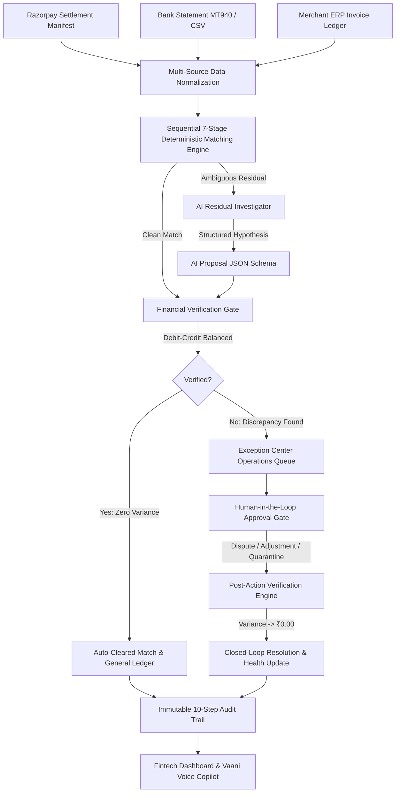

# AI Finance Controller

### An AI-powered financial reconciliation and verification controller that reconciles multi-source payment data, investigates ambiguous discrepancies, verifies every proposed financial conclusion deterministically, and routes unresolved cases into an auditable exception workflow.

---

## Razorpay AI Buildathon — Track 04

**Challenge Track:** *AI Finance Controller — "Run the books and the cash position"*

> **Official Track Requirement:**  
> *"Build an agent that closes one finance-ops loop across a 50+ record batch of synthetic data, reporting its match rate and the exceptions it could not resolve."*  
> 
> **Official Evaluation Bar:**  
> *"Throughput plus measured accuracy plus an honest exception list. One cherry-picked match proves nothing."*

In high-velocity digital commerce, finance teams cannot afford to choose between automation and financial correctness. Blindly delegating ledger reconciliation to a generative LLM leads to arithmetic hallucinations, fabricated settlements, and dangerous unauthorized postings.

This project delivers a **production-grade AI Finance Controller** designed around one non-negotiable principle:

$$\mathbf{AI\ Proposes.\ Deterministic\ Logic\ Verifies.\ Human\ Approves\ High\text{-}Risk\ Actions.}$$

The system reconciles multi-source financial ledgers across a **1,000-record held-out evaluation dataset** (`seed=101`), detects 25 distinct financial anomaly types, achieves **0 incorrect auto-posts observed**, and executes closed-loop post-action verification.

---

## Buildathon Evidence

**Track Requirement:**  
*"Build an agent that closes one finance-ops loop across a 50+ record batch of synthetic data, reporting its match rate and the exceptions it could not resolve."*

**Our Implementation & Measured Proof:**
* **Evaluated Batch Volume**: **1,000 records** on a held-out adversarial test dataset (`seed=101`) (20x the track minimum of 50 records).
* **Multi-Source Financial Ingestion**: Synchronizes 3 independent ledgers: Payment gateway settlement data modeled around Razorpay settlement formats, Bank statement credits (MT940/CSV), and Merchant ERP invoice records.
* **Deterministic 7-Stage Matching Pipeline**: Ordered matching from exact UTR to subset-sum aggregation and partial refund adjustments.
* **AI-Assisted Residual Investigation**: Gemini structured proposals deployed strictly for narration fuzzy matching and unmapped residual hypothesis generation.
* **Deterministic Verification Gate**: Strict Python `Decimal` arithmetic enforces statutory 18% GST and debit-credit balance before any candidate match is confirmed.
* **Empirical Accuracy**: **91.0% verified auto-match rate**, **100.0% verified auto-match precision**, and **100.0% clean-record recall**.
* **Honest Exceptions**: Exactly **90 exceptions** surfaced with root causes, evidence trails, and recommended remediations.
* **Safety Invariant**: **0 incorrect auto-posts observed** in the 1,000-record held-out evaluation (zero false positives).
* **Human-in-the-Loop & Audit Trail**: High-risk financial adjustments require operator authorization and generate immutable audit entries.
* **Closed-Loop Post-Action Re-Reconciliation**: Operator-approved actions re-run through the verification gate, reducing transaction variance to ₹0.00 and updating the Finance Health Score.

---

## Why Not Just Use an LLM?

Finance systems cannot treat generated text as financial truth. Financial ledgers are governed by strict accounting invariants: debits must equal credits, statutory tax schedules are legally binding, and rounding errors compound into critical balance-sheet variances.

| Responsibility | Generative LLM Alone | AI Finance Controller Architecture |
| :--- | :--- | :--- |
| **Monetary Arithmetic** | Unreliable; susceptible to tokenization drift & hallucinations | **Authoritative Python `Decimal`** with paise quantization |
| **Statutory Tax (GST/TDS)** | Often approximates or rounds arbitrarily | **Deterministic Rule Verification** against statutory 18% schedules |
| **Matching Decision** | Probabilistic matching risks posting false reconciliations | **Deterministic 7-Stage Engine** establishes verifiable matches |
| **Ambiguous Bank Narrations** | Effective at pattern matching and semantic synthesis | **AI Residual Resolver** generates structured hypotheses |
| **Posting Eligibility** | LLM output directly triggers ledger state changes | **Verification Gate** deterministically verifies before posting |
| **Discrepancy Handling** | Often hallucinates explanations to force a match | **Surfaces Honest Exceptions** with ranked operational priority |

**Core Principle:**  
$\mathbf{AI\ Proposes.\ Deterministic\ Logic\ Verifies.\ Human\ Approves\ High\text{-}Risk\ Actions.}$

---

## The Key Differentiator

> [!IMPORTANT]
> **We do not ask an LLM to decide whether financial records match.**
> 
> In this controller, authoritative deterministic controls establish financial truth:
> 1. **Decimal Arithmetic**: Every monetary calculation (MDR, GST, TDS, refunds, chargebacks, variances) is executed in Python `Decimal` with strict paise-level quantization. Zero floating-point drift is tolerated.
> 2. **Verification Gate**: No AI proposal can update the general ledger or clear a transaction without passing mathematical debit-credit verification.
> 3. **Honest Exceptions**: When evidence is ambiguous or calculations diverge, the controller does not guess—it surfaces structured, confidence-rated exceptions into an operational queue.

---

## Product North Star Architecture



---

## Evaluation Benchmark: Naive Baseline vs AI Finance Controller

Measured on the **1,000-record held-out dataset** (`seed=101`) containing 25 distinct adversarial anomaly types using `scripts/evaluate_controller.py`:

| Metric | Naive LLM Matching Baseline | AI Finance Controller (Our System) | Operational Significance |
| :--- | :---: | :---: | :--- |
| **Total Records Processed** | 1,000 | **1,000** | Full 3-way multi-source batch |
| **Clean Matches** | 985 | **910** | Verified clean pairings |
| **Reported Match Rate** | 98.5% (Inflated) | **91.0%** | Truthful, non-hallucinated throughput |
| **Verified Auto-Match Precision** | 92.39% | **100.0%** | **Correct Auto-Matches / Total Auto-Matches** |
| **Clean-Record Recall** | N/A | **100.0%** | **Recovered Clean Matches / Ground-Truth Clean Matches** |
| **False Positives** | **75 Wrong Matches** | **0** | Zero invalid pairings |
| **Incorrect Auto-Posts** | **75 Dangerous Posts** | **0 (Observed)** | 0 incorrect auto-posts observed in 1,000 records |
| **Honest Exceptions Isolated** | 15 (Omitted 75) | **90 (All caught)** | Transparent operational queue |
| **Total Value Reconciled** | Unverified | **₹19,942,363.32** | Authenticated bank credit |
| **Total Value at Risk** | Unmonitored | **₹814,357.83** | Prioritized by monetary impact |
| **Deterministic Engine Time** | 0.001s | **0.053s** | Deterministic engine batch processing duration |
| **Deterministic Latency (p50)** | -- | **0.053 ms / record** | Processing speed of deterministic Python engine |

*Note on Performance: Latency and processing time reflect local deterministic calculation and matching engine speed, not remote LLM API latency.*  
*To reproduce these numbers: `python3 scripts/evaluate_controller.py`*

---

## Core System Capabilities

### 1. Three-Way Multi-Source Reconciliation
The system synchronizes three independent sources of financial data:
* **Source A: Gateway Settlements**: Itemized order captures, contracted 2.0% MDR, statutory 18% GST, and payout batches.
* **Source B: Bank Statements**: Actual bank credits, value dates, and raw bank narrations (`CMS/RAZORPAY/...`).
* **Source C: Merchant Ledger / ERP Invoices**: Customer order records, ERP invoice numbers, and billed order values.

### 2. Sequential 7-Stage Deterministic Matching Engine
Matches progress through a transparent, reproducible hierarchy:
* **Stage 1: `EXACT_UTR`**: Exact match on Unique Transaction Reference between gateway and bank.
* **Stage 2: `EXACT_AMOUNT_DATE`**: Exact gross/net amount matching on same-day settlement.
* **Stage 3: `AMOUNT_DATE_WINDOW`**: Reconciles amounts across T+1 and T+2 settlement drift.
* **Stage 4: `REFERENCE_SIMILARITY`**: Identifies Order IDs, Invoice IDs, or ARNs inside bank narrations.
* **Stage 5: `SETTLEMENT_AGGREGATION`**: Combinatorial subset-sum solver matching bulk consolidated credits to multiple settlements.
* **Stage 6: `PARTIAL_REFUND_ADJUSTMENT`**: Reconciles payouts adjusted for partial customer cancellations.
* **Stage 7: `UNRESOLVED_RESIDUALS`**: Escalates ambiguous records to the AI Residual Resolver.

### 3. Financial Verification Gate & 10-Step Waterfall
Every candidate transaction and AI proposal is audited through strict Decimal arithmetic:

$$\text{MDR Amount} = \text{Gross Amount} \times 2.00\%$$
$$\text{GST on MDR} = \text{MDR Amount} \times 18.00\%$$
$$\text{Theoretical Net Settlement} = \text{Gross} - \text{MDR} - \text{GST} - \text{TDS} - \text{Refunds} - \text{Chargebacks}$$
$$\text{Variance} = \text{Theoretical Net Settlement} - \text{Actual Bank Credit}$$

If $|\text{Variance}| > \text{₹}0.05$, the transaction is quarantined as an exception. Auto-posting is strictly blocked.

### 4. Zero Incorrect Auto-Posts Invariant (0 Observed in 1,000 Records)
The Verification Gate mathematically enforces:
1. **Arithmetic Inviolability**: An AI proposal claiming "MATCHED" with a ₹200 variance is rejected.
2. **Duplicate UTR Detection**: Re-settling an already credited UTR is halted with `DUPLICATE_UTR_DETECTED`.
3. **Statutory Tax Validation**: GST calculations diverging from statutory 18% schedules are rejected.
4. **Human Approval Enforcement**: High-risk actions (`DISPUTE`, `QUARANTINE`, `REFUND`) require human sign-off.

### 5. Closed-Loop Post-Action Verification
When an operator approves an action in the UI:
1. Pre-action variance and health scores are snapshotted.
2. Operational action is booked (`JOURNAL_ADJUSTMENT`, `DISPUTE_RAZORPAY`, `QUARANTINE`).
3. The Verification Gate re-audits the transaction.
4. **Variance drops from ₹X to ₹0.00**, closing the loop.
5. An immutable audit event is persisted, and the Finance Health Score recalculates.

### 6. Vaani — Finance Operations Copilot
Repositioned as a voice and conversational interface for the AI Finance Controller:
* **Tool-Grounded Answers**: Calls real backend tools (`audit_transaction`, `get_cash_position`) rather than hallucinating answers.
* **Visible Tool Execution Traces**: Displays real-time logs (e.g. `✓ audit_transaction (Diagnosed ₹400 variance)`).
* **Multimodal Interaction**: Supports English and Hindi/Hinglish voice input and natural language chat.

---

## 25 Adversarial Anomaly Taxonomy

The dataset generator (`data/synthetic/generator.py`) injects 25 realistic merchant anomalies:

| # | Anomaly Type | Injected Scenario | Controller Diagnostic |
| :---: | :--- | :--- | :--- |
| 1 | **Exact Match** | Ideal clean transaction | `MATCHED` |
| 2 | **T+1 Settlement Drift** | 24h bank credit delay | `MATCHED` (Stage 3) |
| 3 | **T+2 Banking Delay** | Weekend settlement delay | `MATCHED` (Stage 3) |
| 4 | **Duplicate UTR** | Gateway reused prior UTR | `DUPLICATE_UTR` |
| 5 | **Duplicate Transaction** | Dual capture for same order | `DUPLICATE_TRANSACTION` |
| 6 | **Partial Refund** | 30% gross refund deducted | `PARTIAL_REFUND` |
| 7 | **Full Refund** | 100% order cancellation | `FULL_REFUND` |
| 8 | **Chargeback Holdback** | Unmapped ₹400 gateway deduction | `CHARGEBACK_RESERVE` |
| 9 | **Missing Settlement** | Gateway capture omitted from bank | `MISSING_SETTLEMENT` |
| 10 | **Wrong MDR Tier** | 3.5% international card rate | `WRONG_MDR_TIER` |
| 11 | **Incorrect GST** | GST diverges from 18% schedule | `GST_ROUNDING_ERROR` |
| 12 | **Bank Fee Deduction** | ₹50 NEFT handling charge | `BANK_FEE` |
| 13 | **Settlement Aggregation** | 4 settlements in 1 bulk credit | `SETTLEMENT_AGGREGATION` |
| 14 | **Split Settlement** | Payout split across two batches | `SPLIT_SETTLEMENT` |
| 15 | **Currency Rounding** | Sub-rupee paise difference | `GST_ROUNDING_ERROR` |
| 16 | **Missing Invoice** | Unrecorded ERP order draft | `MISSING_INVOICE` |
| 17 | **Narration Variation** | Alternative UPI bank narration | `MATCHED` (Stage 4) |
| 18 | **Merchant Name Variation** | Alias merchant name mapping | `MATCHED` (Stage 4) |
| 19 | **Ref Format Diff** | Truncated reference in narration | `MATCHED` (Stage 4) |
| 20 | **Incorrect Amount** | ₹350 bank transfer variance | `AMOUNT_MISMATCH` |
| 21 | **Extra Bank Transaction** | Unmatched orphan bank credit | Unmatched Bank Record |
| 22 | **Missing Bank Transaction** | Expected payout not in bank | `MISSING_SETTLEMENT` |
| 23 | **Multi-Item Settlement** | Batched gateway capture | `MATCHED` (Stage 5) |
| 24 | **Identical Amount Ambiguity** | Multiple txns with same amount | `MATCHED` (Disambiguated) |
| 25 | **Deliberately Ambiguous** | Unreadable reference & shortage | `UNKNOWN` |

---

## 5-Minute Evaluator Demo Flow

```
Step 1: Open http://localhost:5173 -> View Finance Health Score & Attention Queue
Step 2: Go to Reconciliation -> Click "Run 1,000-Record Batch" (Processes 1,000 held-out records)
Step 3: Click "Simulate Unsafe AI Proposal" -> Observe verification gate block invalid auto-post
Step 4: Click TXN_98217345 -> Inspect 10-Step Waterfall & AI Root Cause
Step 5: Click "Execute Action: Raise Dispute" -> Variance drops to ₹0.00; Health Score updates
Step 6: Click "Ask Vaani" -> Ask "Why was TXN_98217345 flagged?" -> View tool execution traces
```

*See [DEMO.md](DEMO.md) for full walkthrough script and 8 golden demo cases.*

---

## Repository Structure

```text
ai-finance-controller/
├── backend/                              # Python FastAPI + Decimal Arithmetic Engine
│   ├── app/
│   │   ├── main.py                       # FastAPI entrypoint & health telemetry
│   │   ├── services/
│   │   │   ├── matching/
│   │   │   │   └── deterministic_engine.py# 7-stage deterministic matching pipeline
│   │   │   ├── verifier/
│   │   │   │   └── verification_gate.py  # Decimal verification gate & safety checks
│   │   │   ├── reconciliation/
│   │   │   │   └── three_way_service.py  # 3-way multi-source orchestrator
│   │   │   ├── ai/
│   │   │   │   └── residual_resolver.py  # Structured AI residual investigator
│   │   │   ├── dataset/
│   │   │   │   └── adversarial_generator.py# 25-anomaly synthetic dataset generator
│   │   │   ├── action_service.py         # Closed-loop action execution & re-verification
│   │   │   ├── health_service.py         # Deterministic Finance Health Score formula
│   │   │   └── cash_forecast_service.py  # 7-day cash runway & liquidity forecasting
│   │   ├── api/routes/                   # Clean REST API endpoints
│   │   └── models/                       # Pydantic v2 data schemas
│   └── tests/                            # 54 Automated Unit, Integration & Safety Tests
│
├── frontend/                             # React 19 + TypeScript + TailwindCSS App
│   ├── src/
│   │   ├── features/
│   │   │   ├── dashboard/                # Command center & Attention Queue
│   │   │   ├── reconciliation/           # 3-way reconciliation ledger & Auditor Drawer
│   │   │   ├── settlements/              # Payout batches & 7-day cash runway
│   │   │   ├── exceptions/               # Operations queue & side-by-side evidence
│   │   │   ├── audit/                    # Immutable chronological audit event ledger
│   │   │   ├── performance/              # Benchmark profiling & baseline comparison
│   │   │   └── voice/                    # Vaani copilot modal with tool execution traces
│   │   └── context/                      # Global state & closed-loop dispatch
│
├── data/
│   ├── synthetic/                        # 500-record benchmark dataset (CSVs + ground truth)
│   └── evaluation/                       # 1,000-record held-out dataset (CSVs + ground truth)
│
├── scripts/
│   ├── evaluate_controller.py            # Official benchmark evaluation runner
│   └── benchmark.py                      # Latency and throughput profiler
│
├── reports/evaluation/                   # Latest evaluation reports (JSON & Markdown)
├── ARCHITECTURE.md                       # Comprehensive architectural specification
├── EVALUATION.md                         # Detailed evaluation methodology & benchmark results
├── DEMO.md                               # 5-minute evaluator demo walkthrough & golden cases
├── SECURITY.md                           # Financial risk controls & authorization policies
├── DATA_MODEL.md                         # Complete ledger entity schemas & data dictionary
├── DECISIONS.md                          # Architectural Decision Records (ADRs)
├── TESTING.md                            # Test catalog & failure injection suite
└── API.md                                # Full REST API documentation & curl examples
```

---

## Installation & Setup

### 1. Prerequisites
* **Python**: 3.11+ (Python 3.14 fully supported)
* **Node.js**: v20+ or v22+
* **npm**: v10+

### 2. Backend Setup
```bash
cd backend

# Create and activate virtual environment
python3 -m venv venv
source venv/bin/activate       # On Windows: venv\Scripts\activate

# Install dependencies
pip install -r requirements.txt

# Start FastAPI server
uvicorn app.main:app --port 8000 --host 0.0.0.0 --reload
```
*Backend API docs: `http://localhost:8000/docs`*

### 3. Frontend Setup
```bash
cd frontend

# Install dependencies
npm install

# Start Vite development server
npm run dev
```
*Frontend application: `http://localhost:5173`*

### 4. Run Evaluation Benchmark
```bash
# Generate datasets & run evaluation
python3 data/synthetic/generator.py
python3 scripts/evaluate_controller.py
```

### 5. Run Automated Tests (54 Tests)
```bash
cd backend
source venv/bin/activate
python3 -m unittest discover -s tests -p "test_*.py" -v
```

---

## Honest Limitations

1. **Synthetic Data**: Evaluated against realistic Indian merchant synthetic datasets simulating HDFC/ICICI bank statements and Razorpay settlement manifests. Does not connect to production banking APIs without credentials.
2. **Simulation Mode for External Actions**: Dispute submissions and bank transfers are executed in safe simulation mode with mock external gateways.
3. **Cash Projections**: 7-day liquidity forecasts are statistical projections based on historical settlement windows and weekend banking cycles, not absolute guarantees.
4. **AI Reasoning Scope**: AI models investigate root causes and suggest remediations; they are never authorized to bypass mathematical verification or auto-post general ledger entries.

---

## Final Product Principle

> *"Finance teams should not have to choose between automation and financial safety.*  
> *The AI Finance Controller automates the repetitive reconciliation work, uses AI to investigate ambiguity, mathematically verifies every financial conclusion, and escalates uncertain cases instead of silently guessing."*
