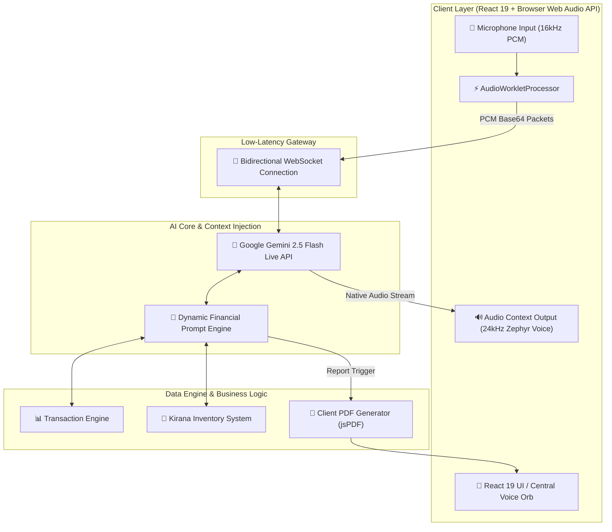
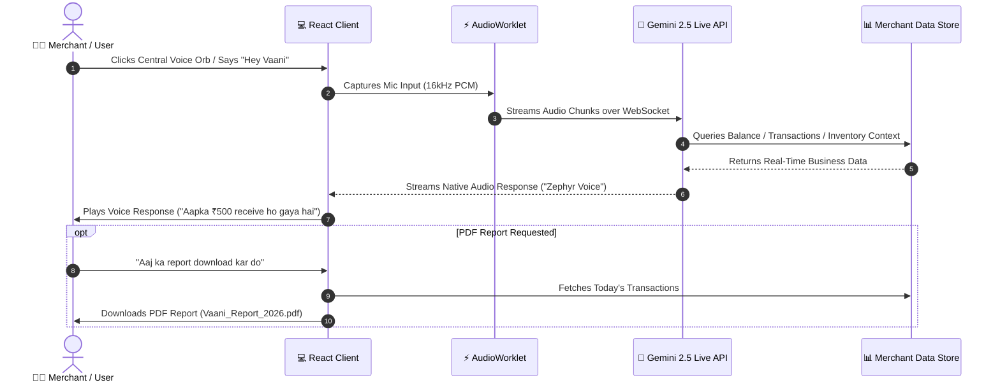

<div align="center">

# 🎙️ Vaani.AI
### *Transforming the Traditional Soundbox into an AI-Powered Virtual CFO*

[](https://react.dev/)
[](https://www.typescriptlang.org/)
[](https://ai.google.dev/)
[](https://vitejs.dev/)
[](https://tailwindcss.com/)
[](https://vaani-ai-navy.vercel.app)
[](https://opensource.org/licenses/MIT)

[🌐 **Live Demo Application**](https://vaani-ai-navy.vercel.app) • [📖 **System Architecture**](#-system-architecture) • [⚡ **Quickstart**](#-installation--quickstart)

</div>

---

## 📌 Executive Summary & Vision

Traditional payment soundboxes (Paytm, PhonePe, BharatPe) are passive speakers that only execute one task: announcing transaction amounts (*"₹50 received on Paytm"*).

**Vaani.AI** revolutionizes retail financial hardware by turning the Soundbox into an **Autonomous, Voice-First Virtual CFO**. Built on top of Google Gemini 2.5 Flash's Native Audio Multimodal Live API, Vaani.AI enables merchants to talk directly to their business data, track inventory sales in real-time, resolve payment disputes, and receive strategic financial advice—all through natural, low-latency Hinglish conversation.

> [!IMPORTANT]
> **Target Audience**: Kirana Stores, Small Retail Merchants, Local Shops, and Micro-Enterprises needing real-time business intelligence without complex ERP dashboards.

---

## 📑 Table of Contents

- [ Executive Summary & Vision](#-executive-summary--vision)
- [ Core Features](#-core-features)
- [ System Architecture](#-system-architecture)
- [ User Workflow](#-user-workflow)
- [ Tech Stack](#-tech-stack)
- [ Repository Structure](#-repository-structure)
- [ Installation & Quickstart](#-installation--quickstart)
- [ Environment Configuration](#-environment-configuration)
- [ Future Roadmap](#-future-roadmap)
- [ Contributing & License](#-contributing--license)

---

## ⚡ Core Features

| Feature | Description | Key Advantage |
| :--- | :--- | :--- |
| 🎙️ **Real-Time Voice AI** | Full Speech-to-Speech interaction powered by Google Gemini 2.5 Flash Native Audio Live Session. | Low-latency WebSockets (<500ms response time). |
| 🔊 **Smart Soundbox Mode** | Automatic audio announcements for incoming payments with customer metadata. | Instant auditory verification for hands-free merchant workflows. |
| 🛒 **Inventory Intelligence** | Real-time cross-referencing of transaction receipts against Kirana store stock levels. | Automatic low-stock alerts & AI restock recommendations. |
| 🚨 **Payment Verification** | Natural voice query verification (*"₹500 aaya kya?"*, *"Last payment kisne ki?"*). | Zero-dashboard instant dispute detection. |
| 📄 **Automated PDF Reports** | Voice-triggered report generation (*"Aaj ka report bhej do"*). | Instant client-side PDF generation using `jspdf`. |
| 🇮🇳 **Native Hinglish Support** | Fully understands mixed Hindi + English slang, dialects, and broken pronunciations. | Tailored specifically for modern Indian retail ecosystems. |

---

### 🔍 Feature Deep Dive

#### 1. 🎙️ Native Speech-to-Speech Engine
Unlike legacy pipelines (STT → LLM → TTS) that suffer from multi-second latency, Vaani.AI leverages Gemini's native audio-in/audio-out capabilities. Audio frames pass directly over bidirectional WebSockets via a browser `AudioWorkletProcessor`.

#### 2. 🛒 Business & Inventory Context Fusion
```
Transaction Receipt -> Product Extraction -> Inventory Matching -> Low-Stock Alert
```
When a payment is processed, Vaani.AI extracts purchased items (e.g., Maggi, Butter, Milk), decrements stock counters, and warns the merchant when safety thresholds are breached.

#### 3. 📄 Instant PDF Statements
Saying *"Aaj ka sales report download kar do"* triggers client-side PDF rendering containing earnings breakdown, transaction tables, and top-selling product categories.

---

## 🏗️ System Architecture



---

## 🔁 User Workflow



---

## 💻 Tech Stack

### Frontend & Core
- **Framework**: React 19 (SPA Architecture)
- **Language**: TypeScript 5.8
- **Build Tool**: Vite 6.2
- **Styling**: Tailwind CSS 4.1, Lucide React Icons
- **Animations**: Framer Motion (`motion/react`)

### AI & Multimodal Engine
- **Core Intelligence**: Google Gemini 2.5 Flash (`gemini-2.5-flash-native-audio-preview-12-2025`)
- **Audio Architecture**: Web Audio API, `AudioWorkletProcessor` (16kHz Input / 24kHz Output)
- **SDK**: `@google/genai` (Native Audio Live Session)

### Backend & Deployment
- **Server**: Express.js (Node.js 22 runtime)
- **Middleware**: Vite Development Middleware
- **Deployment Platform**: Vercel Serverless Platform
- **PDF Engine**: `jspdf`, `jspdf-autotable`

---

## 📂 Repository Structure

```
Vaani-AI/
├── Vaani-AI/                       # Primary Application Workspace
│   ├── src/                        # Source Code
│   │   ├── components/             # UI Components
│   │   │   ├── VoiceAgent.tsx      # Central Orb & Multimodal Voice Controller
│   │   │   ├── Dashboard.tsx       # Merchant Financial Analytics Dashboard
│   │   │   ├── Inventory.tsx       # Stock Management Component
│   │   │   └── TransactionManager.tsx # Payment History & Dispute Tracker
│   │   ├── services/               # Services Layer
│   │   │   └── gemini.ts           # Gemini Live API Client & Context Injector
│   │   ├── mockData.ts             # Kirana Inventory & Financial Dataset
│   │   ├── App.tsx                 # Main Application Layout
│   │   └── main.tsx                # Application Entry Point
│   ├── server.ts                   # Express & Vite Dev Middleware Server
│   ├── vite.config.ts              # Vite & Global Environment Injection Config
│   ├── vercel.json                 # Vercel Deployment & SPA Routing Rules
│   └── package.json                # Dependencies & Build Scripts
└── README.md                       # Project Documentation
```

---

## 🛠️ Installation & Quickstart

### Prerequisites
- **Node.js**: `v18.0.0` or higher
- **npm**: `v9.0.0` or higher
- **Gemini API Key**: Obtain a free key from [Google AI Studio](https://aistudio.google.com/app/apikey)

### Step 1: Clone Repository
```bash
git clone https://github.com/nitesh-20/Vaani-Ai-for-Paytm.git
cd Vaani-Ai-for-Paytm/Vaani-AI
```

### Step 2: Install Dependencies
```bash
npm install
```

### Step 3: Configure Environment
Create a `.env` file in the `Vaani-AI` folder:
```env
GEMINI_API_KEY="your_gemini_api_key_here"
VITE_GEMINI_API_KEY="your_gemini_api_key_here"
APP_URL="http://localhost:3000"
```

### Step 4: Run Development Server
```bash
npm run dev
```
Open **`http://localhost:3000`** in your browser and click the central voice orb to start chatting with Vaani!

### Step 5: Build for Production
```bash
npm run build
```

---

## 🔑 Environment Configuration

```env
# Google Gemini API Key (Required for Live Audio & Multimodal API)
GEMINI_API_KEY=AIzaSy...

# Client-Side Exposed API Key (Used by Vite Client Build)
VITE_GEMINI_API_KEY=AIzaSy...

# Server Host Base URL
APP_URL=http://localhost:3000
```

> [!NOTE]
> When deploying to Vercel, set `GEMINI_API_KEY` and `VITE_GEMINI_API_KEY` in **Vercel Project Settings → Environment Variables**.

---

## 🔮 Future Roadmap

- [ ] **Profit & Loss Analysis**: Real-time margin calculation based on cost prices.
- [ ] **Expense & GST Tracking**: Voice-guided GST categorization and bill filing.
- [ ] **AI Sales Forecasting**: Predictive stock depletion alerts powered by historical sales trends.
- [ ] **WhatsApp Business Reports**: Auto-send daily evening summaries directly to WhatsApp.
- [ ] **Multi-Store Management**: Single voice assistant managing inventory across multiple retail outlets.
- [ ] **Offline Edge Mode**: On-device voice recognition for areas with unstable internet.

---

## 🤝 Contributing

Contributions are what make the open-source community an incredible place to learn, inspire, and create. Any contributions you make are **greatly appreciated**.

1. Fork the Project (`git checkout -b feature/AmazingFeature`)
2. Commit your Changes (`git commit -m 'Add some AmazingFeature'`)
3. Push to the Branch (`git push origin feature/AmazingFeature`)
4. Open a Pull Request

---

## 📄 License

Distributed under the **MIT License**. See `LICENSE` for more information.

<div align="center">

Built with ❤️ for Indian Merchants & Small Businesses by the **Vaani Team**.

</div>
