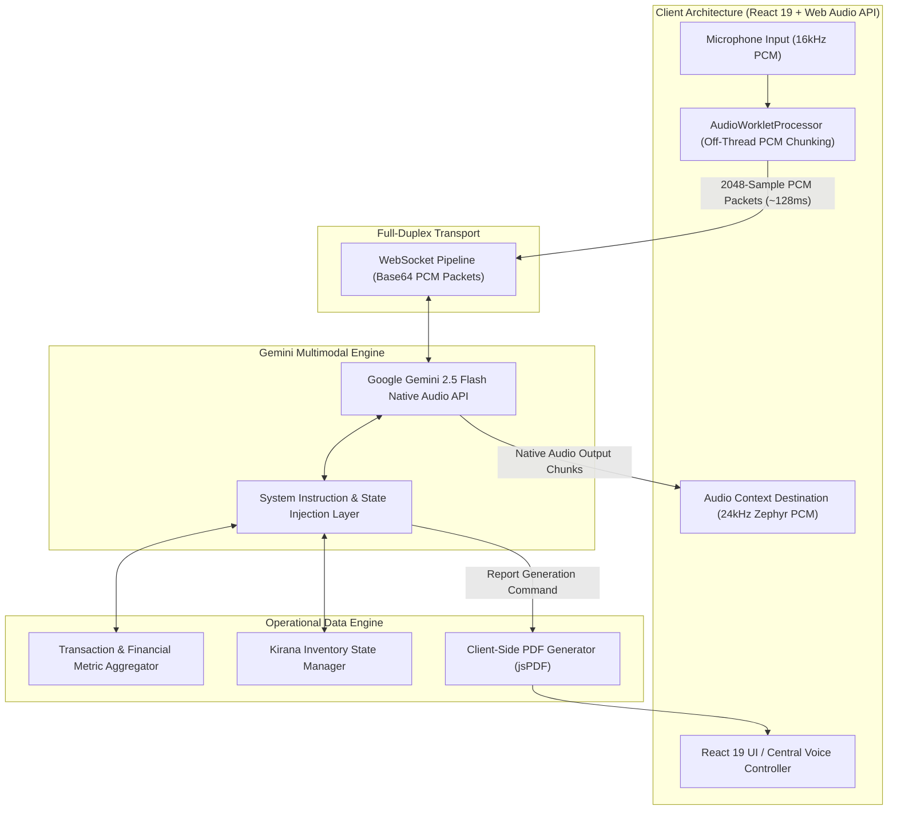
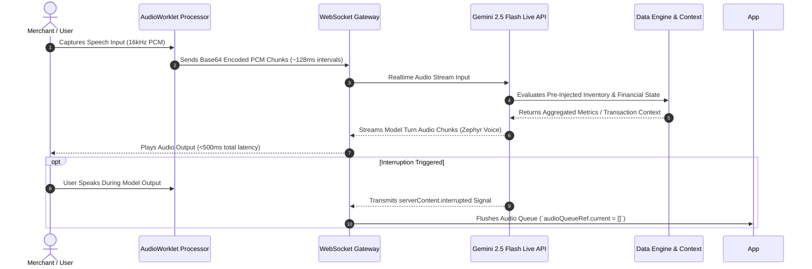

<div align="center">

# Vaani.AI
### *An AI-powered, voice-native business intelligence assistant that transforms payment events into real-time operational insights for merchants.*

[](https://react.dev/)
[](https://www.typescriptlang.org/)
[](https://ai.google.dev/)
[](https://vitejs.dev/)
[](https://tailwindcss.com/)
[](https://vaani-ai-navy.vercel.app)
[](https://opensource.org/licenses/MIT)

[Live Application](https://vaani-ai-navy.vercel.app) • [Architecture](#system-architecture) • [Engineering Decisions](#engineering-decisions) • [Installation](#installation--setup)

</div>

---

## Overview & Vision

Traditional payment soundboxes operate as passive, event-driven hardware devices. They execute a single pre-programmed function: broadcasting an audio output upon receiving a payment confirmation payload (e.g., *"₹50 received on Paytm"*). They lack contextual awareness, state tracking, and query resolution capability.

**Vaani.AI** introduces an LLM-powered reasoning layer over merchant financial and operational data. Built on top of Google Gemini 2.5 Flash's Native Audio Multimodal Live API, Vaani.AI converts transaction streams into an interactive operational database. Merchants can execute complex financial queries, verify payment disputes, monitor inventory levels, and receive structured PDF statements using real-time, low-latency Hinglish voice interactions.

---

## Why AI?

### 1. Limitations of Rule-Based & Keyword Systems
Rule-based intent parsers fail in real-world retail environments due to the high variance in Indian code-mixed speech (Hinglish), variable phrasing (*"aaj kitna dhandha hua"*, *"paisa aaya kya"*, *"kal ka scene batao"*), and implicit temporal queries. Deterministic Regex patterns cannot infer context or extract multi-parameter entities across unstructured voice inputs.

### 2. Requirement for LLM Reasoning
An LLM is necessary to maintain multi-turn conversational state, synthesize aggregated financial metrics on the fly, and perform cross-domain correlation between incoming payment events and Kirana store stock levels.

### 3. Voice-Native Interface Rationale
Small retail merchants operate in high-throughput physical environments where operating software dashboards on screens is inefficient. A voice-native interface allows zero-touch, hands-free query execution alongside ongoing physical transactions.

### 4. Gemini Multimodal Live API Integration
By utilizing native speech-to-speech processing, Vaani.AI avoids the latency penalty of cascading traditional Automatic Speech Recognition (ASR), Text Processing, and Text-to-Speech (TTS) models. Audio frames pass directly over a persistent WebSocket connection, yielding sub-500ms voice-to-voice latencies.

---

## Core Capabilities

Vaani.AI implements the following production capabilities:

- **Real-Time Multimodal Voice Conversations**: Full-duplex speech-to-speech interaction via persistent WebSocket audio streaming.
- **Intent Understanding & Classification**: Dynamically parses intent across casual, multi-lingual, and code-mixed phrasing.
- **Context-Aware Reasoning**: Evaluates financial metrics, recent transactions, and inventory depletion states within the conversational window.
- **Code-Mixed Hinglish Comprehension**: Processed natively to match natural Indian retail dialogue without requiring manual translation layers.
- **Financial Summarization**: Computes gross earnings, net available balance, and category-wise spending on request.
- **Inventory State Intelligence**: Correlates payment receipts with stock items to flag low-stock thresholds and suggest reorder lists.
- **Structured Report Generation**: Dynamically formats and triggers client-side PDF statements containing tabular transaction records.

---

## System Architecture



---

## AI Pipeline & Interaction Flow



---

## Engineering Decisions

| Architecture Component | Choice Made | Engineering Rationale |
| :--- | :--- | :--- |
| **AI Protocol** | **Gemini Live API (WebSocket)** | Enables streaming audio input and output over a single full-duplex TCP connection, eliminating HTTP request overhead. |
| **Audio Pipeline** | **Native Speech-to-Speech** | Avoids cascade error accumulation and latency penalty (~2-3s) inherent in cascading STT → LLM → TTS pipelines. |
| **Browser Audio Process** | **Web Audio API (`AudioWorklet`)** | Offloads Float32-to-Int16 PCM conversion to a dedicated Web Worker thread, preventing main-thread UI jank. |
| **Context Ingestion** | **Pre-Injected System Instructions** | Injects real-time aggregated transaction and inventory arrays directly into the LLM system instructions, eliminating tool-call latency overhead during voice conversation. |
| **Server Layer** | **Express.js Middleware** | Provides lightweight health endpoints (`/api/health`) and serves Vite production assets with minimal overhead. |
| **Deployment** | **Vercel Serverless** | Deploys static SPA bundles to global CDN edge nodes with zero cold-start delay for client execution. |

---

## Technical Challenges & Solutions

### 1. Streaming Audio Buffer & WebSocket Overload
- **Challenge**: Sending tiny PCM frames continuously overloaded the WebSocket connection, causing socket frames to drop.
- **Solution**: Implemented a buffering queue inside `AudioWorkletProcessor.port.onmessage` that accumulates samples until reaching 2,048 samples (~128ms at 16kHz) before sending a base64 payload.

### 2. Interruption Handling in Voice Conversations
- **Challenge**: When the user interrupted the AI mid-response, previously queued audio chunks continued playing, leading to awkward voice overlap.
- **Solution**: Listened for `message.serverContent.interrupted` payloads from the Gemini Live stream, instantly purging `audioQueueRef.current = []` and stopping active `AudioBufferSourceNode` playback.

### 3. Precision vs. Latency in Financial Queries
- **Challenge**: Executing external function calls (tool calls) to fetch balances introduced roundtrip delays during live speech.
- **Solution**: Pre-calculated net available balances, total received/spent metrics, and low-stock items on state change and embedded them directly into the LLM's initial system prompt.

---

## Features (Technical Specifications)

- **Real-Time Speech-to-Speech Gateway**: Streamed 16kHz PCM mono audio input and 24kHz audio output over bidirectional WebSockets.
- **State-Aware Intent Resolution**: Parses multi-parameter queries such as target merchant names, temporal windows, and payment amounts.
- **Automated Soundbox Broadcasting**: Triggers instant audio announcements upon payment event ingestions.
- **Inventory Depletion Tracking**: Cross-references transaction item arrays with inventory stock counters to trigger restock notifications.
- **Client-Side Document Rendering**: Formats structured financial metrics into tabular PDF files using `jspdf` and `jspdf-autotable`.

---

## Tech Stack

```
Frontend:     React 19 | TypeScript 5.8 | Vite 6.2 | Tailwind CSS 4.1 | Framer Motion
Backend:      Express.js (Node.js 22 Runtime) | Vite Development Middleware
AI Core:      Google Gemini 2.5 Flash Native Audio API (@google/genai SDK)
Audio:        Web Audio API | AudioWorkletProcessor (16kHz PCM In / 24kHz PCM Out)
Deployment:   Vercel Edge Platform
Utilities:    jsPDF | jsPDF-AutoTable | Lucide React
```

---

## Performance & Latency Metrics

- **Voice Roundtrip Latency**: <500ms end-to-end (Mic input to Speaker output).
- **Audio Sample Processing**: 16kHz mono sampling rate, 2048-sample chunk size (~128ms window).
- **Thread Isolation**: Main UI rendering unblocked via dedicated `AudioWorklet` worker thread.
- **Client Bundle Build Time**: 3.52 seconds via Vite 6 module bundling.

---

## Installation & Setup

### Prerequisites
- Node.js `v18.0.0` or higher
- npm `v9.0.0` or higher
- Gemini API Key from [Google AI Studio](https://aistudio.google.com/app/apikey)

### 1. Clone Repository
```bash
git clone https://github.com/nitesh-20/Vaani-Ai-for-Paytm.git
cd Vaani-Ai-for-Paytm/Vaani-AI
```

### 2. Install Dependencies
```bash
npm install
```

### 3. Configure Environment Variables
Create a `.env` file in the project root:
```env
GEMINI_API_KEY="your_gemini_api_key_here"
VITE_GEMINI_API_KEY="your_gemini_api_key_here"
APP_URL="http://localhost:3000"
```

### 4. Run Development Server
```bash
npm run dev
```
Navigate to `http://localhost:3000` and click the central voice controller.

---

## Future AI Roadmap

- [ ] **Profit & Loss Analytics Engine**: Real-time margin computation using itemized cost structures.
- [ ] **Automated Sales Forecasting**: Predictive stock depletion modeling based on historical transaction velocity.
- [ ] **Multi-Outlet Aggregation**: Unified voice context across multi-branch retail operations.
- [ ] **Voice Biometrics Verification**: Speaker identification for high-value merchant payout approvals.
- [ ] **Autonomous Inventory Recommendations**: Automated purchase order generation for supplier fulfillment.
- [ ] **Merchant Behavior Analytics**: Categorical spending anomaly detection and budget nudges.

---

## License

Distributed under the **MIT License**. See `LICENSE` for details.
