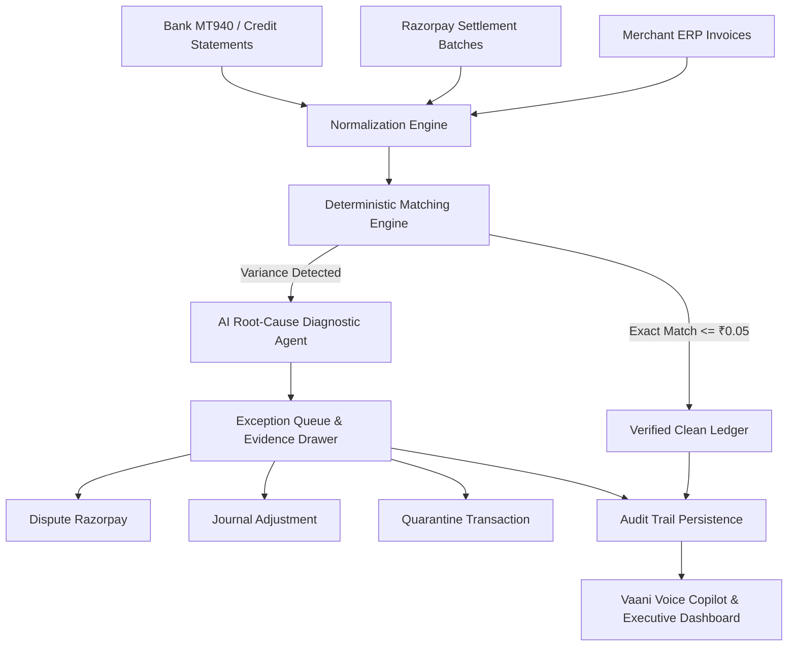
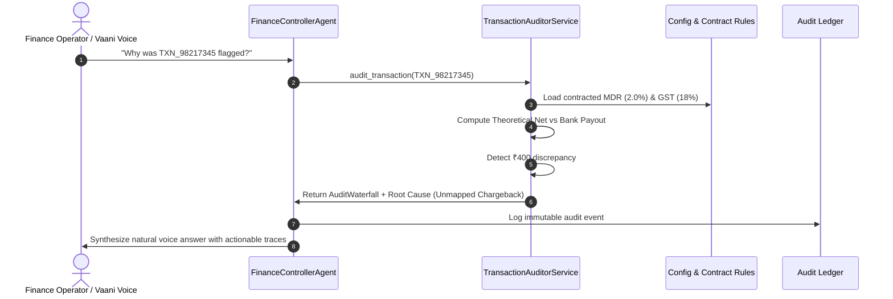

# Architecture: AI Finance Controller

## Overview
The **AI Finance Controller** is an enterprise-grade fintech operations and automated reconciliation platform designed for high-volume payment processing environments (e.g. Razorpay, Stripe, PayU, PhonePe).

It combines a **Deterministic Financial Arithmetic Engine** with an **Autonomous Multi-Agent Intelligence Layer** and a **Voice AI Copilot** to automate reconciliation, detect fee variances, classify dispute root causes, forecast liquidity, and maintain audit trails.

---

## Architectural Topology

```
┌─────────────────────────────────────────────────────────────┐
│              React Fintech Operations Portal                │
│ (Razorpay Blue Aesthetic · Responsive Tabs · Contextual Voice)│
└──────────────────────────────┬──────────────────────────────┘
                               │ REST / WebSocket
┌──────────────────────────────▼──────────────────────────────┐
│                    FastAPI Backend Router                   │
│   (/reconciliation · /settlements · /exceptions · /voice)   │
└──────────────────────────────┬──────────────────────────────┘
                               │
       ┌───────────────────────┴───────────────────────┐
       │                                               │
┌──────▼────────────────────────┐    ┌─────────────────▼───────────┐
│     Multi-Agent Orchestrator   │    │ Deterministic Finance Engine│
│                                │    │                             │
│ • Finance Controller Agent     │    │ • 10-Step Waterfall Formula │
│ • Reconciliation Agent         │    │ • Contracted MDR Validation │
│ • Settlement Batch Agent       │    │ • Statutory 18% GST Engine  │
│ • Exception Priority Agent     │    │ • Duplicate Charge Detector │
│ • Forecasting Liquidity Agent  │    │ • Missing Settlement Check  │
│ • Voice Copilot Agent          │    │ • Ledger Adjustment Rules   │
└──────────────┬─────────────────┘    └──────────────┬──────────────┘
               │                                     │
               └──────────────────┬──────────────────┘
                                  │
┌─────────────────────────────────▼───────────────────────────┐
│                 Data Persistence & Ledger Store             │
│ (Synthetic Transactions · Settlement Batches · Audit Trail) │
└─────────────────────────────────────────────────────────────┘
```

---

## Key Design Principles

1. **Deterministic Calculation Over LLM Guesswork**:
   - Financial formulas (Gross, MDR, GST, TDS, Net, Variance) are executed purely in Python deterministic code.
   - LLMs and Agents are utilized strictly for **orchestration**, **root-cause explanation**, **anomaly synthesis**, and **natural language dialogue**.

2. **Immutable Explainability & Auditability**:
   - Every transaction undergoes a structured 10-step audit trace:
     `Input Record -> MDR Computation -> GST Computation -> Theoretical Net -> Payout Comparison -> Variance Calculation -> Root Cause Diagnostic -> Recommended Action`.

3. **Multi-Agent Specialization**:
   - Rather than relying on a single large prompt, discrete agents handle specialized domains:
     - `FinanceControllerAgent`: Central coordinator and dispatcher.
     - `ReconciliationAgent`: Ledger matching and anomaly detection.
     - `SettlementAgent`: Gateway batch integrity and payout schedules.
     - `ExceptionAgent`: Operations queue and severity triage.
     - `CashForecastAgent`: 7-day rolling cash liquidity forecasting.

---

## 3-Way Reconciliation Dataflow



---

## Transaction Audit Sequence



     - `ExceptionAgent`: Severity scoring and priority queue management.
     - `ForecastingAgent`: Rolling 7-day cash flow projections.
     - `AuditAgent`: Compliance trail generation and proof logging.
     - `VoiceAgent`: Natural language audio intent parsing and TTS formatting.
